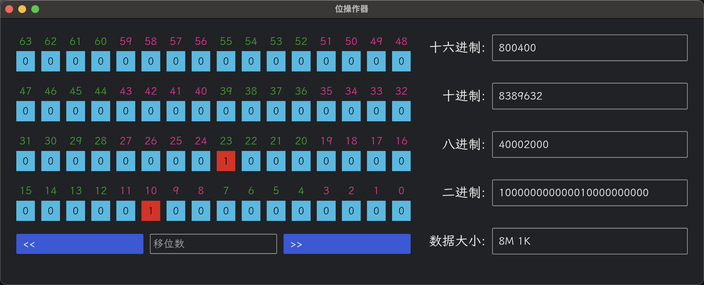

# 位操作器 (Bit Operator)

[](https://www.rust-lang.org/)
[](LICENSE)
[](https://github.com/username/bit-ops-rs)

一个用 Rust 编写的直观的位操作工具，提供了友好的图形界面来查看和修改 64 位整数。

## 预览



## 功能特点

- 📊 以 4x16 网格显示 64 位二进制数据
- 🎨 使用不同颜色区分位组，提高可读性
- 🔄 支持多种进制转换：
  - 十六进制 (Hex)
  - 十进制 (Dec)
  - 八进制 (Oct)
  - 二进制 (Bin)
- 📏 支持数据大小表示和转换
  - 支持 B、K、M、G、T 单位
  - 支持组合格式（如 "1K 512B" 或 "1K1B"）
- ⚡ 位操作功能：
  - 点击按钮切换单个位的值
  - 支持左移和右移操作（可指定移位数量）
- 🖥️ 现代化界面：
  - 采用霞鹜文楷字体
  - 自适应布局

## 安装

确保你已安装 Rust 工具链，然后执行：

```bash
git clone https://github.com/username/bit-ops-rs.git
cd bit-ops-rs
cargo build --release
```

编译完成后，可执行文件将位于 `target/release/bit-ops-rs`。

## 使用说明

### 基本操作

- **位查看与编辑**：
  - 64位数据以4行16列的网格形式显示
  - 每4列使用不同颜色区分，提高可读性
  - 每个位上方显示其索引（0-63）
  - 点击任意位按钮可切换该位的值（0/1）

- **位移操作**：
  - 使用 `<<` 按钮进行左移
  - 使用 `>>` 按钮进行右移
  - 在中间输入框输入移位数量（1-64）
  - 未指定数量时默认移动1位

### 数据输入方式

1. **进制转换**：
   ```
   十六进制：FF（或0xFF）  → 255
   十进制：   255          → 255
   八进制：   0o377        → 255
   二进制：   0b11111111   → 255
   ```

2. **数据大小表示**：
   ```
   基本单位：
   1K = 1024 B
   1M = 1024 K
   1G = 1024 M
   1T = 1024 G

   组合示例：
   1K 512B = 1536 字节
   1K1B    = 1025 字节
   1G1M1K1B = 1,074,791,425 字节
   ```

### 显示格式

- **二进制视图**：
  - 从上到下显示高位到低位
  - 从右到左显示每行的位值
  - 高亮显示1和0，使用不同颜色

- **进制显示**：
  - 十六进制：自动大写（例如：FF）
  - 十进制：无前缀
  - 八进制：无前缀
  - 二进制：完整显示所有位
  - 数据大小：自动选择最适合的单位组合

## 开发指南

### 开发环境设置

1. **环境要求**:
   - Rust 1.75.0 或更高版本
   - 支持的操作系统：
     - Windows 10 或更高版本
     - macOS 10.15 或更高版本
     - Linux (需要 GTK 3)

2. **构建命令**：
   ```bash
   # 开发构建
   cargo run

   # 发布构建
   cargo build --release

   # 运行测试
   cargo test
   ```

### 项目依赖

- **[iced](https://github.com/iced-rs/iced) 0.13.1**
  - 现代化的跨平台 GUI 框架
  - 使用 system 特性实现原生窗口支持
  - 提供响应式布局系统

- **[bitvec](https://github.com/bitvec-rs/bitvec) 1.0.1**
  - 高效的位操作实现
  - 支持位级别的访问和修改
  - 提供直观的位操作接口

### 字体说明

程序使用[霞鹜文楷](https://github.com/lxgw/LxgwWenKai)作为默认字体：
- 字体文件已内置在程序中
- 如果系统已安装该字体，将优先使用系统字体
- 支持中文显示

### 贡献指南

欢迎为项目做出贡献！

1. Fork 本仓库
2. 创建特性分支：`git checkout -b feature/NewFeature`
3. 提交更改：`git commit -m 'Add NewFeature'`
4. 推送分支：`git push origin feature/NewFeature`
5. 提交 Pull Request

## 许可证

本项目采用 Apache 2.0 许可证。详见 [LICENSE](LICENSE) 文件。
